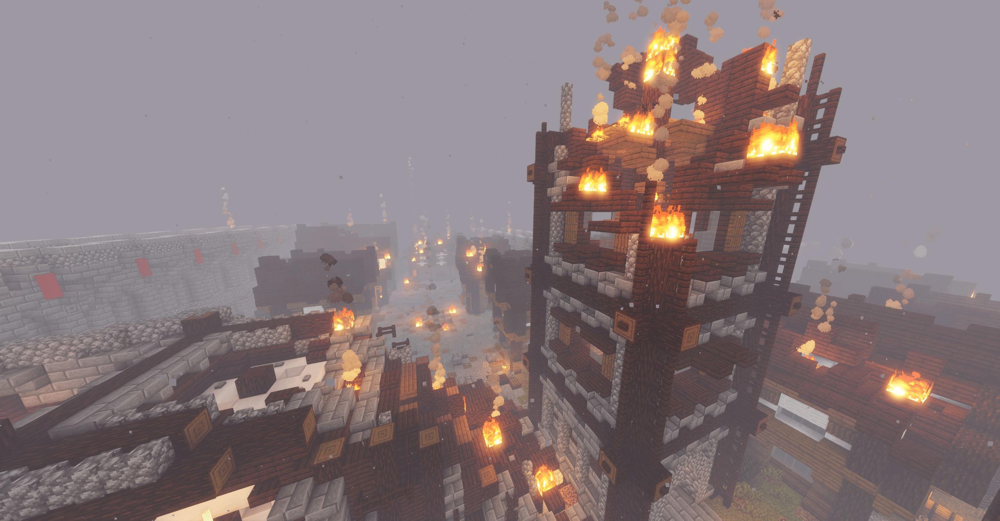

# ZenithServer.net

**This repository hosts the static website for the Zenith Minecraft: Java Edition server. The game server is permanently shut down and its code remains closed source to protect sensitive user data.**

## Stay Connected

## What Was Zenith?

ZenithServer.net was a survival Minecraft: Java Edition server featuring community-built towns, war machines, and an evolving economy. Though the server is offline, the website remains as an archive of the project.

## Plugins Used

Some of the plugins that powered Zenith:

- **EssentialsX** – core commands & utilities
- **WorldEdit** – in-game world editing tools
- **LuckPerms** – permissions management
- **Dynmap** – live world map
- **GriefPrevention** – land claiming
- **CoreProtect** – block logging and rollback

## Gallery

*A view of one of the player-built towns.*

*One of the custom war machines.*

## License

[LICENSE.txt](LICENSE.txt)

